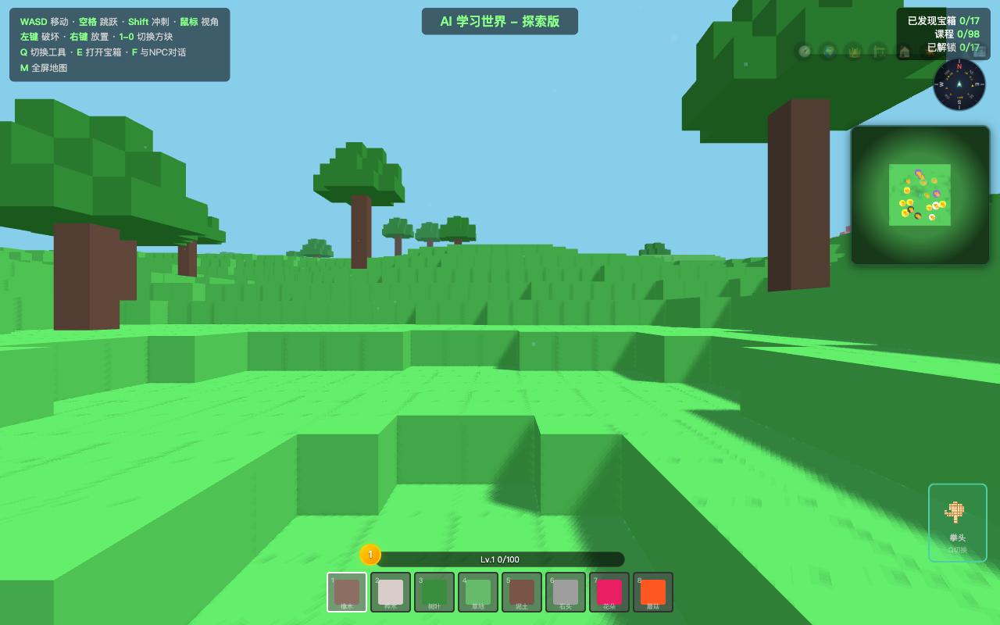
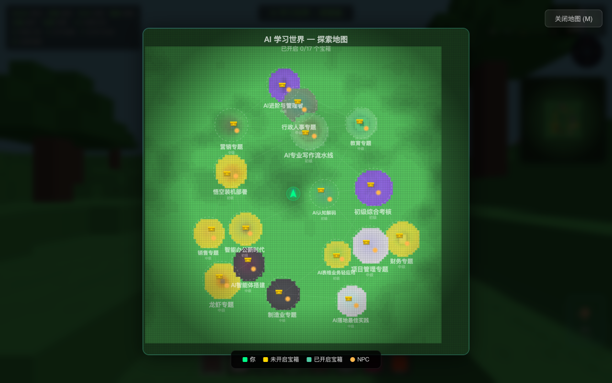
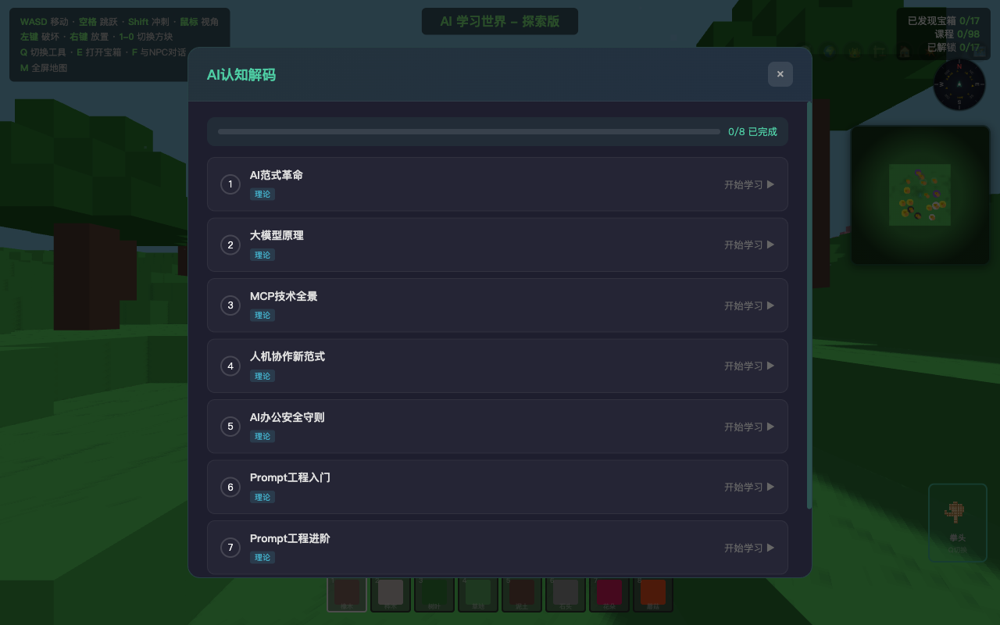

# AI 学习世界 - 探索版

一款基于 Three.js 的 3D 体素探索学习游戏，在 Minecraft 风格的开放世界中探索并学习 AI 相关知识与技能。

## 游戏截图

### 探索世界


### 全屏地图


### 学习模块


## 游戏特色

- **开放世界探索** — 9 种生态群系（森林、沙漠、雪地、湿地、火山、海洋、樱花林、水晶谷、草原），每个区域拥有独特的地形、植被和天气效果
- **AI 知识学习** — 内置 11 个学习模块，涵盖 AI 认知、智能办公、AI 写作、智能体搭建、行业专题等，通过探索发现宝箱并完成课程考核
- **像素风工具系统** — Minecraft 风格的像素画工具图标（拳头、镐子、斧头、锤子），通过完成学习模块解锁
- **AI 助手伙伴** — 完成学习模块后解锁 AI 主题伙伴（数据精灵、算力火花、知识水晶等），提供探索加速、经验加成等增益效果
- **NPC 引导系统** — 每个学习区域配有 NPC，提供学习提示和方向指引
- **经验等级系统** — 通过学习活动获取经验值，提升等级，以学习为核心的成长体系
- **天气系统** — 根据生态群系动态切换雨/雪/晴天气效果
- **自由建造** — 学习区域外的世界可自由破坏和放置方块
- **地图导航** — 罗盘、小地图、全屏地图三级导航系统，标注宝箱与 NPC 位置
- **本地存档** — 学习进度、放置方块、经验等级、AI 助手均通过 localStorage 自动保存

## 学习模块

| 等级 | 模块名称 | 内容方向 |
|------|---------|---------|
| 初级 | AI 认知解码 | AI 基础概念与发展历程 |
| 初级 | 智能办公新时代 | AI 办公工具与效率提升 |
| 初级 | AI 专业写作流水线 | AI 辅助内容创作 |
| 初级 | AI 表格业务轻应用 | AI 数据处理与分析 |
| 初级 | 悟空装机部署 | AI 环境搭建与部署 |
| 初级 | 初级综合考核 | 初级阶段综合测评 |
| 中级 | AI 智能体搭建 | 智能体设计与实现 |
| 中级 | 行政人事专题 | AI 在行政人事中的应用 |
| 中级 | 项目管理专题 | AI 赋能项目管理 |
| 中级 | 销售专题 | AI 销售场景应用 |
| 中级 | 教育专题 | AI 教育场景应用 |

## 操作说明

| 按键 | 功能 |
|------|------|
| WASD | 移动 |
| 空格 | 跳跃（支持二段跳） |
| Shift | 冲刺 |
| 鼠标 | 视角控制 |
| 左键 | 破坏方块 |
| 右键 | 放置方块 |
| 1-0 | 切换方块类型 |
| Q | 切换工具 |
| E | 打开宝箱 |
| F | 与 NPC 对话 |
| M | 全屏地图 |

## 快速开始

### 方式一：浏览器直接打开

无需安装任何依赖，直接在浏览器中打开即可：

```bash
git clone https://github.com/GingerYang19/ai-learning-world-explore.git
open ai-learning-world-2.html
```

### 方式二：Windows 桌面版

从 [Releases](https://github.com/GingerYang19/ai-learning-world-explore/releases) 下载 `AI学习世界-探索版 Setup 1.0.0.exe` 安装包，双击安装即可运行。

如需自行构建：

```bash
cd desktop-app
npm install
npm run build:win
```

构建产物在 `desktop-app/dist/` 目录下。

## 技术栈

- **Three.js r128** — 3D 渲染引擎（CDN 加载）
- **InstancedMesh** — 体素地形高性能渲染
- **Perlin Noise (fbm)** — 程序化地形生成
- **Canvas 2D** — 罗盘、小地图、全屏地图绘制
- **Pointer Lock API** — FPS 风格视角控制
- **localStorage** — 本地数据持久化

## 项目结构

```
├── ai-learning-world-2.html   # 探索版（主文件，浏览器直接打开）
├── desktop-app/               # Electron 桌面版
│   ├── main.js                # Electron 主进程
│   ├── preload.js             # 预加载脚本
│   ├── package.json           # 构建配置
│   ├── icon.png               # 应用图标
│   └── game/index.html        # 游戏文件
├── screenshots/               # 游戏截图
└── README.md
```

## License

MIT
